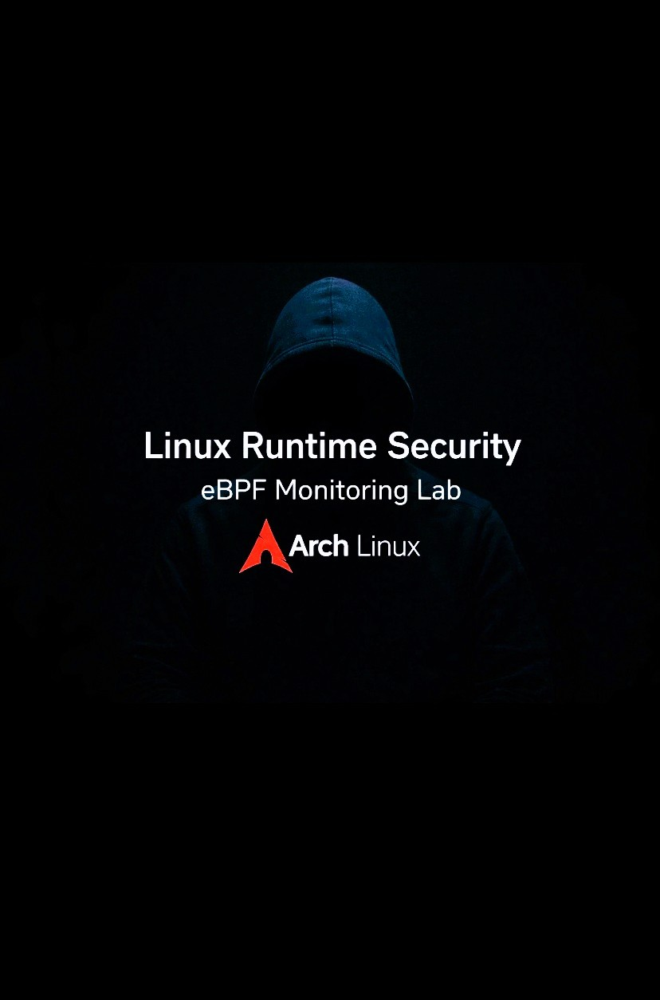
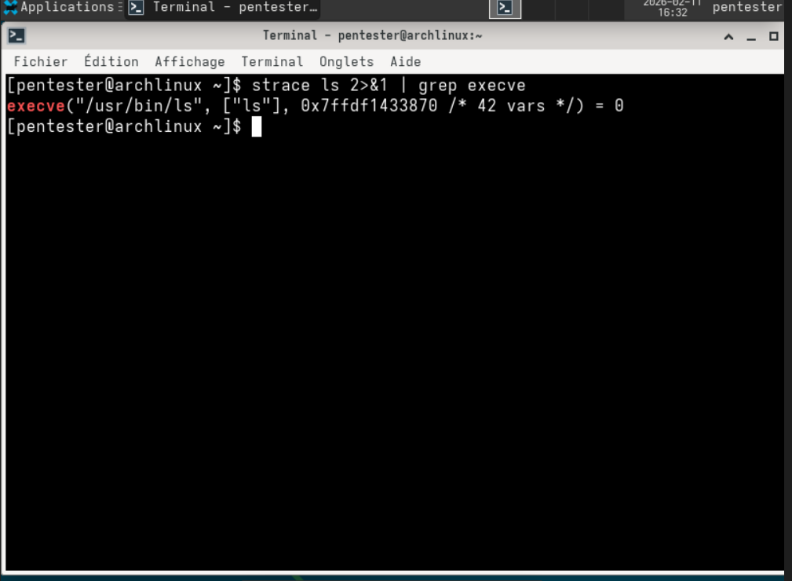
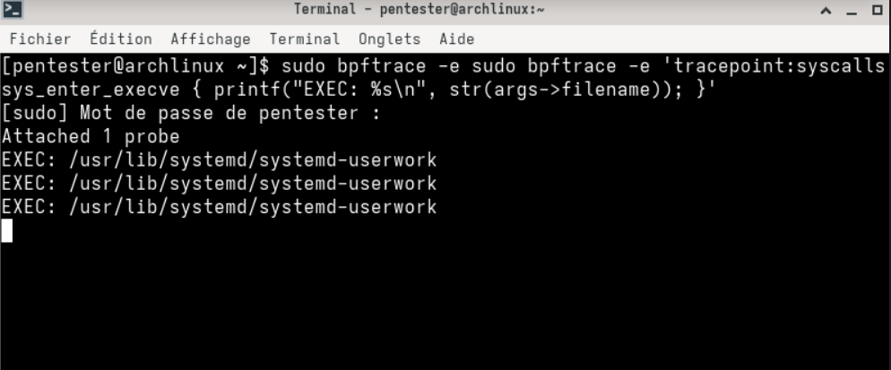
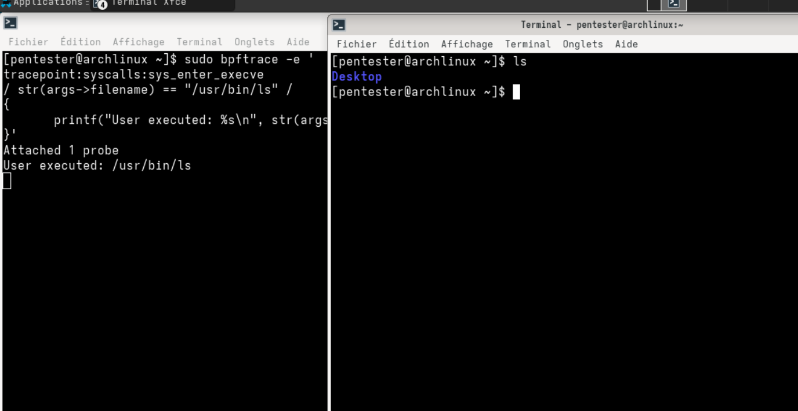
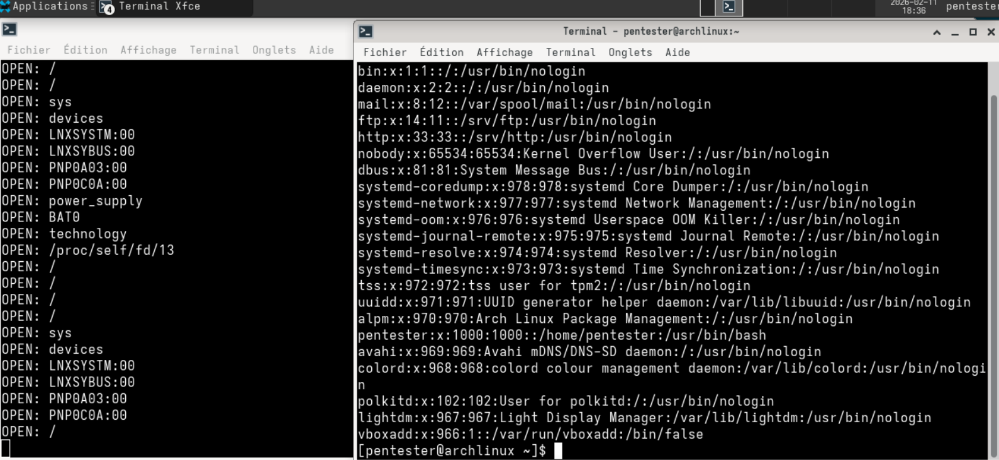

  
  &nbsp;
  
  &nbsp;
  
  &nbsp;
  

<h1 align="center">
  Arch Linux Runtime Security - eBPF Monitoring Lab
</h1>

  

---

© 2026 Virginie Lechene - Tous droits réservés 
Reproduction interdite sans autorisation préalable. 
Usage pédagogique uniquement.

---

Ce projet a été réalisé dans un environnement contrôlé et isolé 
(Arch Linux sous VirtualBox), 
dans un cadre strictement pédagogique et expérimental.

## Sommaire

- [Avancement global du portfolio](#avancement-global-du-portfolio)
- [Linux Runtime Security - Lab eBPF](#linux-runtime-security--lab-ebpf)
  - [Présentation](#présentation)
  - [Objectifs](#objectifs)
  - [Perspective Attaquant - Comment un système peut être infiltré](#perspective-attaquant--comment-un-système-peut-être-infiltré)
  - [Architecture](#architecture)
  - [Implémentation](#implémentation)
    - [Étape 1 - Monitoring des exécutions (execve)](#étape-1--monitoring-des-exécutions-execve)
    - [Étape 2 - Filtrage ciblé](#étape-2--filtrage-ciblé)
    - [Étape 3 - Monitoring des accès fichiers (openat)](#étape-3--monitoring-des-accès-fichiers-openat)
  - [Concepts abordés](#concepts-abordés)
  - [Pourquoi c’est important ?](#pourquoi-cest-important)
  - [Limites observées](#limites-observées)
  - [Conclusion](#conclusion)
  - [Auteur](#auteur)

---

## Avancement global du portfolio

| Projet | Fonction | Statut |
|--------|----------|--------|
| 1 | Linux Runtime Monitoring (eBPF) | 🟢 Terminé |
| 2 | Business Logic & Human Factor Lab | ⚪ À venir |
| 3 | Tool Limitations & False Positives | ⚪ À venir |
| 4 | IA as an Adversary | ⚪ À venir |

---

# Linux Runtime Security - Lab eBPF

## Présentation

Ce projet démontre la surveillance du système Linux au niveau noyau     
à l’aide de la technologie **eBPF** et de l’outil **bpftrace**.   

Projet réalisé sur **Arch Linux (VirtualBox)** dans un environnement contrôlé et isolé.    
Kernel-level syscall monitoring using eBPF and bpftrace
---  

## Objectifs  

- Comprendre le fonctionnement des syscalls Linux   
- Observer en temps réel l’exécution de processus (`execve`)   
- Surveiller les accès fichiers (`openat`)   
- Attacher un programme eBPF à des tracepoints noyau   
- Comprendre les bases de la détection comportementale   

---   

## Outils et technologies   

- **Arch Linux** (Kernel récent, environnement minimaliste)   
- **Oracle VirtualBox** (Isolation système contrôlée)   
- **bpftrace** (Frontend eBPF basé sur BCC)   
- **eBPF** (Extended Berkeley Packet Filter)   
- **Tracepoints noyau Linux** (`sys_enter_execve`, `sys_enter_openat`)   

---  

## Perspective attaquant - Comment un système peut être infiltré   

Ce projet montre la surveillance des syscalls `execve` et `openat`.     
Ces appels système sont fréquement observés lors d'activités malveillantes.   

### Exemple de scénario réaliste   

Un attaquant pourrait :    

- Obtenir un accès initial (phishing, mot de passe faible, service exposé)   
- Exécuter un binaire malveillant (`execve`)   
- Lire des fichiers sensibles (`openat`)   
  - `/etc/passwd`   
  - `/etc/shadow`   
  - clés SSH   
- Installer une persistance (cron, service systemd)   

---

### Pourquoi ce projet est pertinent   

En surveillant :   

- L'exécution de processus inhabituels   
- L’accès à des fichiers sensibles   

On peut détecter une activité suspecte avant qu’elle ne devienne critique.   

---   

## Validation de l’environnement

Espace utilisateur   
↓   
bpftrace   
↓   
Programme eBPF   
↓   
Tracepoint noyau (syscalls)   
↓   
Affichage en temps réel   

  

---      

## Implémentation      

### Étape 1 - Monitoring des exécutions (execve)   

sudo bpftrace -e 'tracepoint:syscalls:sys_enter_execve {   
    printf("EXEC: %s\n", str(args->filename));   
}'   

Exemple de sortie :   

EXEC: /usr/bin/ls   
EXEC: /usr/bin/whoami   
EXEC: /usr/bin/bash   

  

---

Étape 2 - Filtrage ciblé   

sudo bpftrace -e 'tracepoint:syscalls:sys_enter_execve    
/ str(args->filename) == "/usr/bin/ls" /   
{   
    printf("User executed: %s\n", str(args->filename));   
}'   

  

 

---

Étape 3 - Monitoring des accès aux fichiers (openat)   

sudo bpftrace -e 'tracepoint:syscalls:sys_enter_openat {   
    printf("OPEN: %s\n", str(args->filename));   
}'   

Exemple de sortie :   

OPEN: /etc/passwd   
OPEN: /home/pentester/.Xauthority   
OPEN: /proc/self/cmdline   

  

⸻   

## 🟢 Évolutions prévues

Ce projet a été conçu dans un objectif pédagogique et de compréhension des mécanismes eBPF sous Linux.

A terme, il pourra évoluer vers une approche plus avancée du monitoring runtime et de la détection comportementale.

### 🔎 Améliorations possibles

- Ajout d’un schéma explicatif du flux eBPF :
  Espace utilisateur → Programme eBPF → Tracepoint noyau → Sortie utilisateur
- Ajout d’une analyse contextuelle enrichie (PID, UID, processus parent)
- Mise en place d’une corrélation d’événements
- Réduction avancée du bruit système
- Comparaison technique avec `auditd`
- Structuration du projet sous forme d’outil plus modulaire

---

> ⚠️ L’objectif actuel du projet est la compréhension des mécanismes internes.
> Les améliorations listées ci-dessus représentent des pistes d’évolution et ne constituent pas le périmètre initial.

--- 

Concepts abordés    
	•	Syscalls Linux (execve, openat)   
	•	Tracepoints noyau   
	•	Architecture eBPF   
	•	Instrumentation dynamique   
	•	Monitoring runtime   
	•	Notion de bruit système   
	•	Détection comportementale   

⸻   

Pourquoi c’est important ?    

Les solutions modernes de sécurité (EDR, runtime security, container security)   
utilisent eBPF pour surveiller :   
	•	Les exécutions suspectes   
	•	Les accès aux fichiers sensibles   
	•	Les élévations de privilèges   
	•	Les comportements anormaux   

⸻      

Limites observées   
	•	Volume important de bruit système   
	•	Nécessité de filtrage avancé    
	•	Pas de corrélation d’événements    
	•	Pas d’analyse de contexte (PID, UID, parent)   

⸻   

✍️ Auteur : *Virginie Lechene*

---

## Licence
Le script est publié sous la licence MIT.

## À propos de l’usage
Ce projet est destiné exclusivement à des fins pédagogiques, notamment dans le cadre de :
- d’une formation en cybersécurité,
- de tests d’intrusion légaux (pentest),
- d’analyses réseau dans un environnement contrôlé.

Ce dépôt a pour objectif la compréhension des mécanismes internes de Linux et des techniques de détection.

⚠️ L’auteure n’autorise en aucun cas l'utilisation de ce projet à des fins illégales ou malveillantes.
Toute utilisation non conforme est interdite et relève uniquement de la responsabilité de l’utilisateur.

## Droits sur les visuels
Les visuels, illustrations ou captures présents dans ce dépôt sont la propriété exclusive de l’auteure.
Toute reproduction ou utilisation non autorisée est interdite.

